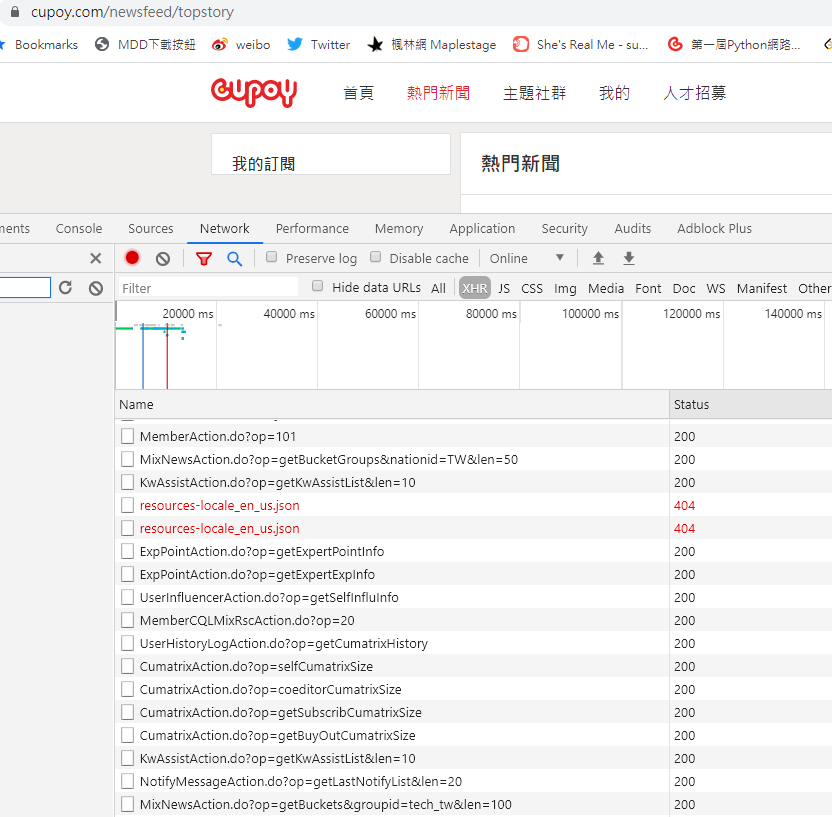
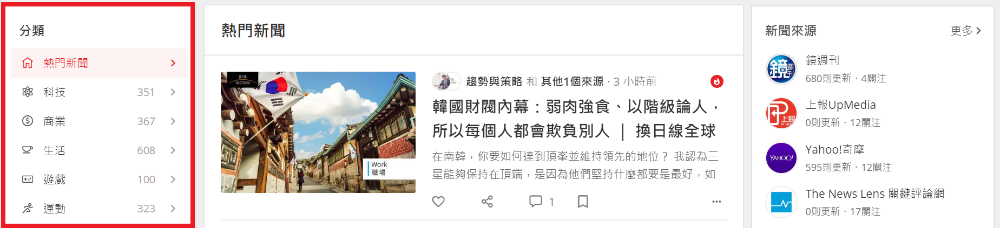

# 1st-PyCrawlerMarathon Final Project: Cupoy News Crawler


01 Project Abstract 專題摘要
---
從 Cupoy新聞 TOP500 中找到時下熱門關鍵字

#### 1. 爬蟲: Cupoy
  - 利用Chrome Dev Tools 了解動態網頁結構
  - 了解如何活用API，透過變化 request key parameters，減少request所索取新聞的篇數以加速收到回應的時間 
  - 由 multi-processing 來加速發送 API request 的回應緩慢瓶頸
  - 從API獲取的新聞基本資料中，找到各篇新聞的 hyperlink，進而爬取來自不同新聞媒體網站的各個新聞內文
  - 統計 TOP500 新聞中的熱門新聞分類
  - 找出以 "社群網站"、"Cupoy新聞" 或 "趨勢關鍵字" 不同評分方式中最為熱門的新聞 
  
#### 2. 爬蟲: 各大新聞媒體網站
  - 利用 Chrome Dev Tools 了解各大新聞網站設計的網頁結構
  - 利用 Python library [newspaper](https://newspaper.readthedocs.io/en/latest/index.html) 作為主要的爬蟲工具，爬取新聞內文
  - 利用 [Beautifulsoup](https://www.crummy.com/software/BeautifulSoup/bs4/doc/) 分析html，進而作為次要的爬取新聞內文方式
  
#### 3. 關鍵字分析
  - 利用 [Jieba](https://github.com/fxsjy/jieba) 中文分詞，對爬取下來的新聞內文做關鍵字抽取
  - 利用 [WordCloud](https://amueller.github.io/word_cloud/index.html) 將抽取出來的關鍵字繪製成文字雲

02 Implementation 實作方法
---
介紹使⽤的程式碼、模組，並附上實作過程與結果的截圖，需圖文並茂。

#### 1. 爬蟲: Cupoy

##### -利用Chrome Dev Tools 了解動態網頁結構

[Cupoy新聞](https://www.cupoy.com/newsfeed/topstory) 網頁往下滑到底，網頁會將更多則新聞載入進來，由此可判斷*Cupoy新聞*為動態新聞
再進一步至 Dev Tools 中的 *Network* 查看，發現他們前端是透過呼叫各種API將資料連結回網頁上



##### -了解如何活用API

Cupoy獲取新聞的API `MixNewsAction.do` 在這次專題中會用的兩支分別是:

1. 熱門新聞 `(?op=getTopMixNews)`


2. 新聞類別 `(?op=getBucketGroups)`


而想要獲取500篇熱門新聞，可以透過指定參數 `?len=500`，直接要求API傳回500篇新聞資料。

但一次就將500篇新聞撈回來，資料量過於龐大，不管是對後端資料庫、網路資料傳輸、或是客戶端資料存取，都會吃不消。選擇適當的新聞篇數，可加速API的回應速度。

若批次撈回(每批共50篇)，就需指定撈取的起始位置 `?startNewsID=0`，否則再怎麼呼叫API也只會撈取到同樣的前50篇新聞。

#### -Multi-processing 加速批次requests的回應緩慢瓶頸

將每一批次的 request process 丟到 `Pool` 中，由 `Pool` 根據 cpu resource 控制同時執行的 process 數量，並收回每個process的output。

程式碼
```
from multiprocessing import Pool
with Pool() as pool:
    results = [pool.apply_async(function_for_process, (startNewsID, )) 
                for startNewsID in range(0, 500, 50)]
```

#### -從API獲取的新聞基本資料中，找到各篇新聞的 hyperlink，進而爬取來自不同新聞媒體網站的各個新聞內文

API回傳的資料結構很簡單，新聞連結就是 `linkurl` key所對應到的值。
也因為資料結構的完整，後續的統計分析要拿相關欄位的資料，並整理成 `pandas.DataFrame`也很容易。


#### -統計 TOP500 新聞中的熱門新聞分類

每篇新聞會記錄其所屬的類別id。由於每篇新聞的類別並不限於一種，根據每一種新聞類別id，去計數含有該類別的新聞總數。
而每個id可以透過另一支API `(?op=getBucketGroups)` 撈取新聞類別清單，對應到id 的中文名稱。

統計結果範例如下，當中商業新聞佔最多數:
```
商業 62
生活 58
科技 54
親子家庭 42
職場白領 38
享樂女性 37
3C達人 22
國際財經 21
運動 12
城市食旅 12
文青聚落 11
健身瘦身 10
御宅學園 9
設計 3
```

#### -找出以 "社群網站"、"Cupoy新聞" 或 "趨勢關鍵字" 不同評分方式中最為熱門的新聞 

API回傳的資料結構中，發現每篇新聞有四種熱門分數，包括 *趨勢關鍵字熱門分數* `keywordtrend`、 Cupoy新聞熱門分數 `uidactscore`、 社群網站熱門分數 `socialactscore` 以及綜合熱門分數 `activescore`。

不同的評分方式中，分別找出分數最高的新聞，反映出在不同的平台上各自最熱門新聞的差別。


#### 2. 爬蟲: 各大新聞媒體網站
newspaper 功用 


#### 3. 關鍵字分析

03 Demonstration 成果展⽰
---
介紹成果的特點為何，並撰寫⼼心得。

[Jupyter Notebook: 新聞爬蟲](https://github.com/susan8213/1st-PyCrawlerMarathon-Project-Cupoy/blob/master/cupoy_crawler.ipynb)

[Jupyter Notebook: 關鍵字分析](https://github.com/susan8213/1st-PyCrawlerMarathon-Project-Cupoy/blob/master/jieba_analysis.ipynb)


04 Conclusion 結論
---
總結本次專題的問題與結果。
