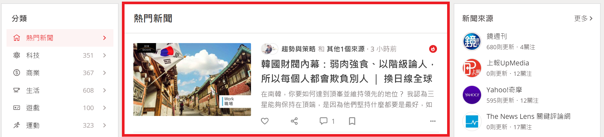
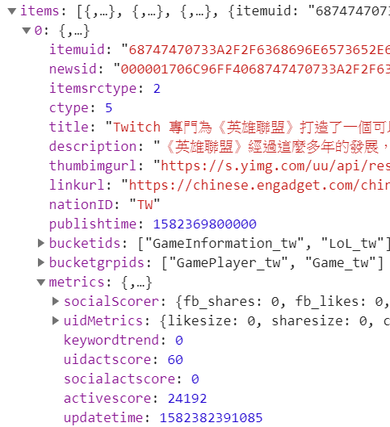
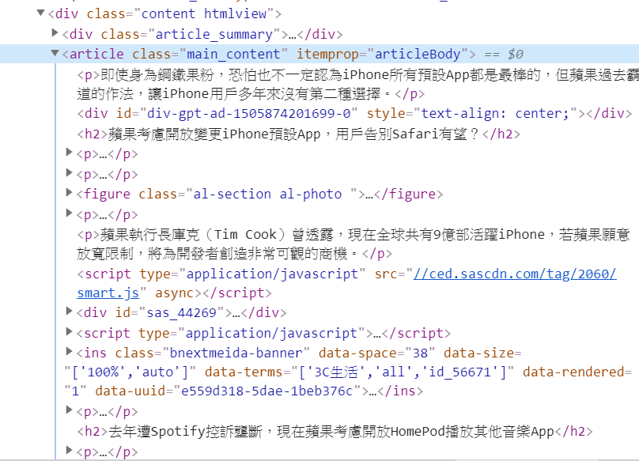

# 1st-PyCrawlerMarathon Final Project: Cupoy News Crawler


01 Project Abstract 專題摘要
---
從 Cupoy新聞 TOP500 中找到時下熱門關鍵字

#### 1. 爬蟲: Cupoy
  - 利用Chrome Dev Tools 了解動態網頁結構
  - 了解如何活用API，透過變化 request key parameters，減少request所索取新聞的篇數以加速收到回應的時間 
  - 由 multi-processing 來加速發送 API request 的回應緩慢瓶頸
  - 從API獲取的新聞基本資料中，找到各篇新聞的 hyperlink，進而爬取來自不同新聞媒體網站的各個新聞內文
  - 統計 TOP500 新聞中的熱門新聞分類
  - 找出以 "社群網站"、"Cupoy新聞" 或 "趨勢關鍵字" 不同評分方式中最為熱門的新聞 
  
#### 2. 爬蟲: 各大新聞媒體網站
  - 利用 Chrome Dev Tools 了解各大新聞網站設計的網頁結構
  - 利用 Python library [newspaper](https://newspaper.readthedocs.io/en/latest/index.html) 作為主要的爬蟲工具，爬取新聞內文
  - 利用 [Beautifulsoup](https://www.crummy.com/software/BeautifulSoup/bs4/doc/) 分析html，進而作為次要的爬取新聞內文方式
  
#### 3. 關鍵字分析
  - 利用 [Jieba](https://github.com/fxsjy/jieba) 中文分詞，對爬取下來的新聞內文做關鍵字抽取
  - 利用 [WordCloud](https://amueller.github.io/word_cloud/index.html) 將抽取出來的關鍵字繪製成文字雲

02 Implementation 實作方法
---
介紹使⽤的程式碼、模組，並附上實作過程與結果的截圖，需圖文並茂。

#### 1. 爬蟲: Cupoy

##### -利用Chrome Dev Tools 了解動態網頁結構

[Cupoy新聞](https://www.cupoy.com/newsfeed/topstory) 網頁往下滑到底，網頁會將更多則新聞載入進來，由此可判斷*Cupoy新聞*為動態新聞。
再進一步至 Dev Tools 中的 *Network* 查看，發現他們前端是透過呼叫各種API將資料連結回網頁上。


##### -了解如何活用API

Cupoy獲取新聞的API `MixNewsAction.do` 在這次專題中會用的兩支分別是:

1. 熱門新聞 `(?op=getTopMixNews)`


2. 新聞類別 `(?op=getBucketGroups)`


而想要獲取500篇熱門新聞，可以透過指定參數 `?len=500`，直接要求API傳回500篇新聞資料。

但一次就將500篇新聞撈回來，資料量過於龐大，不管是對後端資料庫、網路資料傳輸、或是客戶端資料存取，都會吃不消。選擇適當的新聞篇數，可加速API的回應速度。

若批次撈回(每批共50篇)，就需指定撈取的起始位置 `?startNewsID=0`，否則再怎麼呼叫API也只會撈取到同樣的前50篇新聞。

##### -Multi-processing 加速批次requests的回應緩慢瓶頸

將每一批次的 request process 丟到 `Pool` 中，由 `Pool` 根據 cpu resource 控制同時執行的 process 數量，並收回每個process的output。

程式碼
```
from multiprocessing import Pool
with Pool() as pool:
    results = [pool.apply_async(function_for_process, (startNewsID, )) 
                for startNewsID in range(0, 500, 50)]
```

##### -從API獲取的新聞基本資料中，找到各篇新聞的 hyperlink，進而爬取來自不同新聞媒體網站的各個新聞內文

API回傳的資料結構很簡單，新聞連結就是 `linkurl` key所對應到的值。
也因為資料結構的完整，後續的統計分析要拿相關欄位的資料，並整理成 `pandas.DataFrame`也很容易。



##### -統計 TOP500 新聞中的熱門新聞分類

每篇新聞會記錄其所屬的類別id。由於每篇新聞的類別並不限於一種，根據每一種新聞類別id，去計數含有該類別的新聞總數。
而每個id可以透過另一支API `(?op=getBucketGroups)` 撈取新聞類別清單，對應到id 的中文名稱。

統計結果範例如下，當中商業新聞佔最多數:
```
商業 62
生活 58
科技 54
親子家庭 42
職場白領 38
享樂女性 37
3C達人 22
國際財經 21
運動 12
城市食旅 12
文青聚落 11
健身瘦身 10
御宅學園 9
設計 3
```

##### -找出以 "社群網站"、"Cupoy新聞" 或 "趨勢關鍵字" 不同評分方式中最為熱門的新聞 

API回傳的資料結構中，發現每篇新聞有四種熱門分數，包括 *趨勢關鍵字熱門分數* `keywordtrend`、 Cupoy新聞熱門分數 `uidactscore`、 社群網站熱門分數 `socialactscore` 以及綜合熱門分數 `activescore`。

不同的評分方式中，分別找出分數最高的新聞，反映出在不同的平台上各自最熱門新聞的差別。


#### 2. 爬蟲: 各大新聞媒體網站

##### -利用 Chrome Dev Tools 了解各大新聞網站設計的網頁結構

從Cupoy API提供的新聞連結，我首先人工到各新聞連結查看各大新聞網站的網頁結構。
因為500篇新聞所屬的新聞媒體非常的多元，有幾家新聞媒體就會有幾種網頁結構需要分析，老實說這讓人非常挫折。

以 *數位時代* 為例，欲爬蟲的新聞內文只在整個網頁版面上的中間那一塊，其他的上標側欄什麼的皆屬不需要的垃圾資訊，甚至是文中的圖片也是不需要的。


進一步看網頁的html，新聞內文是放在 tag `article` 中的 paragaph `<p>` 中，這是很常間的新聞網頁架構。 



再來看另外一種網頁架構 *機器之心*:

這個例子也是很常見的新聞網頁架構，整篇文章可以分成 "新聞標題"、"新聞摘要" 以及 "新聞內文"。
`class="article"`裡，新聞標題放在`class="article__title"`、新聞摘要`class="article__summary"`，而新聞內文則是`class="article__content"`。

*機器之心* 比較奇葩的部分是，新聞內文不是用`<p>`組成，而是用`<section>`，這特殊的設計讓爬蟲的困難度增加，需要針對其做額外的處理。


接著，若從網頁類型來看這些媒體新聞網站，還能分成:
1. hard code 寫死在html裡
2. html載入前的js. script
3. html載入後的js. script

第一、二種能透過 requests & Beautifulsoup 爬取到新聞內文，而第三種可能就必須使用 selenium。

##### -主要爬蟲工具 "newspaper"

由於各家媒體網頁設計有許多的差異，靠自己解析出不同網站的新聞有一定的難度，且很耗時耗工。套用別人寫好的強大library看來是必要的。

**newspaper** 是專業的新聞網站爬蟲框架，已經有多家媒體網站被完美解析。只要指定網站(甚至還能指定新聞類別)，newspaper直接就能將該網站中的所有新聞爬取下來，功能非常的強大。(註: 不使用 newspaper 直接爬 Cupoy網站，是因為 Cupoy 並非國際上有名的新聞媒體，且Cupoy API已提供了完整的資訊)

若是指定新聞連結，也只需幾行程式就能利用newspaper將不同新聞網站的新聞內文爬取下來:

```
article = Article(url) # constructor: 輸入欲爬取的新聞url
article.download()     # 下載新聞 html
article.parse()        # 解析新聞內文
article.nlp()          # 針對內文做nlp，抽取關鍵字
```

專題後面有個主題會練習到如何抽取關鍵字，因此本專題並無使用 `article.nlp()` 這捷徑來抽取關鍵字。

newspaper 還有一項進階功能，利用多執行緒(multi-threading) 以減少爬取多個新聞內文所需之時間。因時間不多，本專題尚未嘗試該功能。

##### -次要爬蟲工具 "Beautifulsoup"

newspaper 雖然強大，但仍然有很多新聞無法被解析。因此利用 **Beautifulsoup** 爬取剩下沒被解析出來的新聞。

像是上述舉例的兩個例子，爬取 *數位時代* 的方式

`text = [p.text for p in soup.find('article').find_all('p')]`

爬取 *機器之心* 的方式

`text = [p.text for p in soup.find_all('section')]`


#### 3. 關鍵字分析

03 Demonstration 成果展⽰
---
介紹成果的特點為何，並撰寫⼼心得。

[Jupyter Notebook: 新聞爬蟲](https://github.com/susan8213/1st-PyCrawlerMarathon-Project-Cupoy/blob/master/cupoy_crawler.ipynb)

[Jupyter Notebook: 關鍵字分析](https://github.com/susan8213/1st-PyCrawlerMarathon-Project-Cupoy/blob/master/jieba_analysis.ipynb)


04 Conclusion 結論
---
總結本次專題的問題與結果。
